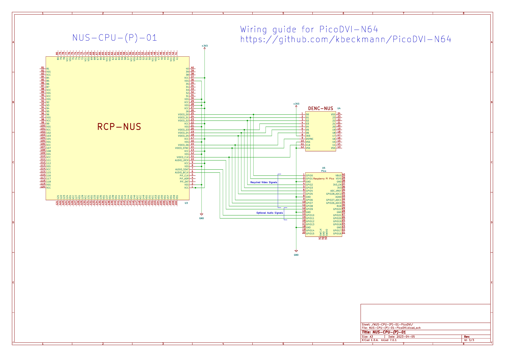
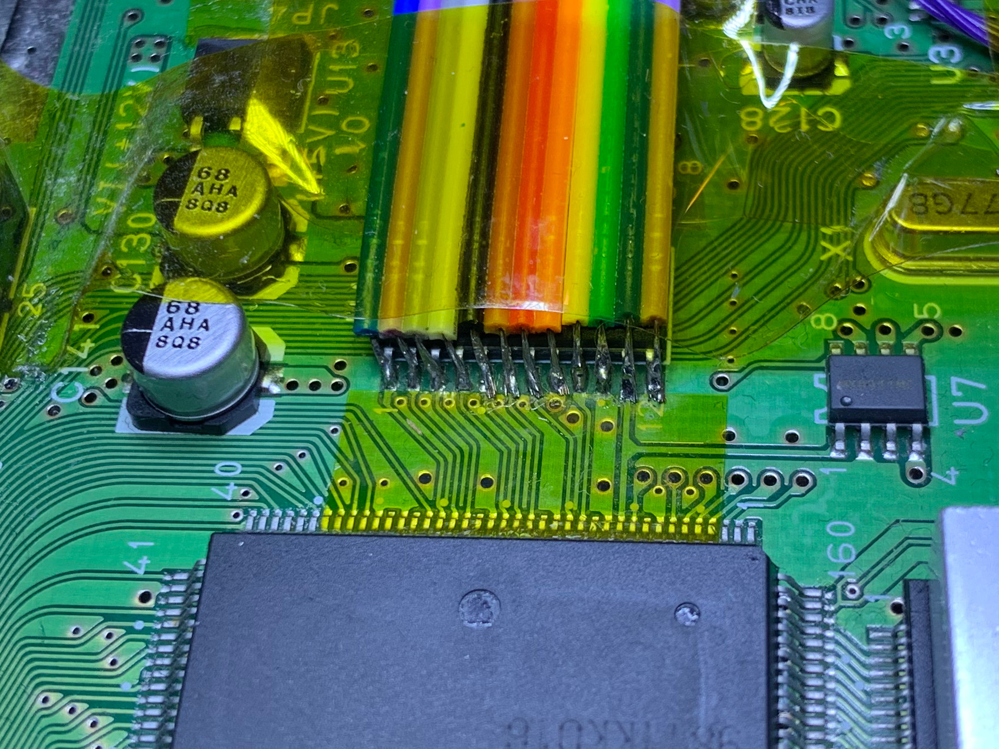

# N64 Digital Video Out Using PicoDVI

This project allows you to output digital video from an N64 using a Raspberry Pi Pico and a DVISock.

## Hardware Requirements

- Raspberry Pi Pico
- DVISock

The digital video signals need to be wired to the Pico as per the wiring diagram below:




## Pre-Built Binaries

Pre-built binaries are available in the Releases section of this GitHub repository. You can download the latest binary by following these steps:

1. Click on the Releases tab.
2. Select the most recent release.
3. Download the "PicoDVI-N64" zip file which contains `.uf2` files that can be programmed to the pico.

The "PicoDVI-N64" zip file contains the following `.uf2` files:

- `picodvi-n64-32000hz-rgb555.uf2`: 32,000 Hz, 15-bit color
- `picodvi-n64-32000hz-rgb565.uf2`: 32,000 Hz, 16-bit color
- `picodvi-n64-44100hz-rgb555.uf2`: 44,100 Hz, 15-bit color
- `picodvi-n64-44100hz-rgb565.uf2`: 44,100 Hz, 16-bit color
- `picodvi-n64-48000hz-rgb555.uf2`: 48,000 Hz, 15-bit color
- `picodvi-n64-48000hz-rgb565.uf2`: 48,000 Hz, 16-bit color
- `picodvi-n64-96000hz-rgb555.uf2`: 96,000 Hz, 15-bit color
- `picodvi-n64-96000hz-rgb565.uf2`: 96,000 Hz, 16-bit color
- `picodvi-n64.uf2`: Default configuration (96,000 Hz, 15-bit color)

Choose the `.uf2` file that matches your desired audio sample rate and color depth, and use it to flash the Pico. Some applications or games may work better with some configurations.

## Building the Software

Before building the software, ensure you have a working [Pico SDK](https://github.com/raspberrypi/pico-sdk) setup.

Follow these steps to build the software:

```
cd software
mkdir build
cd build
cmake ..
make n64
```
After building the software, you will have a `apps/n64/n64.uf2` file which you can use to flash the Pico.

## Credits

This project has been made possible thanks to the following repositories:

- [PicoDVI by Wren6991](https://github.com/Wren6991/PicoDVI)
- [pico_lib by shuichitakano](https://github.com/shuichitakano/pico_lib)
- [PicoDVI by mlorenzati](https://github.com/mlorenzati/PicoDVI.git)